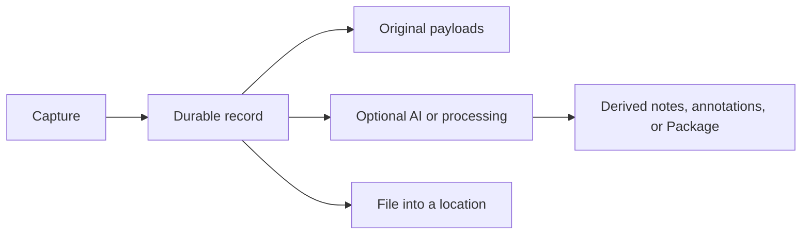

Every Bowerbirds capture surface ends in the same contract: a durable record with searchable text, attributed metadata, and zero or more payload files.

## What you can capture

<CardGroup cols={3}>
  <Card title="Screens and photos" icon="camera">
    Keep the original, flattened annotation, editable session, and numbered comments together.
  </Card>
  <Card title="Recordings" icon="microphone">
    Combine microphone, device audio, and screen, then choose processing outputs later.
  </Card>
  <Card title="Video and Blink" icon="video">
    Keep raw recordings and derive representative, annotated scenes later.
  </Card>
  <Card title="Notes and dictation" icon="note-sticky">
    Revise safely in a Scratchpad, or dictate text directly into the active app.
  </Card>
  <Card title="Files" icon="paperclip">
    Import any local artifact without pushing its bytes through model context.
  </Card>
  <Card title="Web reports" icon="browser">
    Let visitors submit annotated captures through a write-only widget key.
  </Card>
</CardGroup>

## File first, process second

This ordering is important for filed captures and recordings. Transcription, polishing, classification, and recording analysis may fail, be declined, run later, or use a different worker. The source remains available regardless.

<Info>
  Dictation is the deliberate exception: successful text is delivered to the active app and is not filed. Failed audio remains local for 72 hours for retry or discard.
</Info>

## Capture payload pattern

An editable screenshot usually carries three payload roles:

| Example file | Role | Purpose |
| --- | --- | --- |
| `raw.png` | `original` | Untouched source pixels |
| `annotated.png` | `annotated` | Flattened image used for display and export |
| `session.json` | `capture-session` | Editable marks, comments, geometry, and canvas size |

Unknown future annotation kinds are skipped individually rather than invalidating the whole capture.

<Note>
  Capture text is also meaningful. Numbered comments are serialized into the record content so agents can search and reason over the capture before loading its pixels.
</Note>
