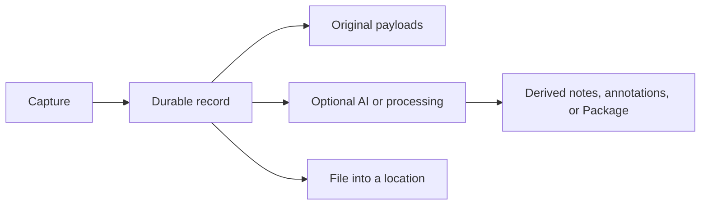

Every Bowerbirds capture surface creates searchable context with the files needed to review or reuse it later.

## What you can capture

<CardGroup cols={3}>
  <Card title="Screens and photos" icon="camera">
    Keep the original, reviewed annotations, and numbered comments together.
  </Card>
  <Card title="Recordings" icon="microphone">
    Combine microphone, device audio, and screen, then choose processing outputs later.
  </Card>
  <Card title="Video and Blink" icon="video">
    Keep raw recordings and derive representative, annotated scenes later.
  </Card>
  <Card title="Notes and dictation" icon="note-sticky">
    Revise safely in a Scratchpad, or dictate text directly into the active app.
  </Card>
  <Card title="Files" icon="paperclip">
    Import any local artifact without pushing its bytes through model context.
  </Card>
  <Card title="Web reports" icon="browser">
    Let visitors submit annotated captures through a write-only widget key.
  </Card>
</CardGroup>

## File first, process second

Optional transcription, polishing, classification, or recording analysis does not replace the original capture.

<Info>
  Dictation is the deliberate exception: successful text is delivered to the active app and is not filed. Failed audio remains local for 72 hours for retry or discard.
</Info>

## Working with capture files

An editable screenshot can include the original image, the reviewed annotated image, and supporting data used by Bowerbirds. Programmatic clients should list the available files and select the one appropriate for the task.

<Note>
  Numbered comments are searchable, so an agent can often understand a capture before downloading its image.
</Note>
