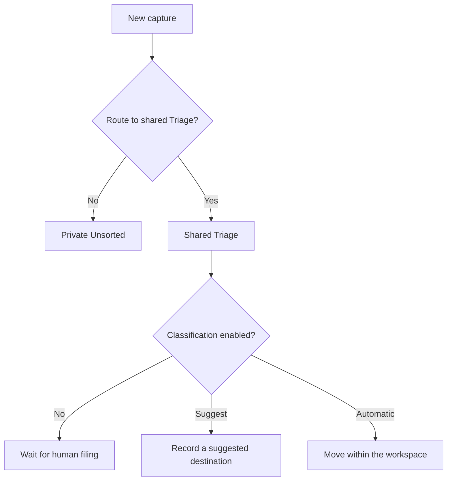

Bowerbirds separates **routing** from **classification**.

Routing chooses where a new capture is born. Classification is optional later work that proposes or performs a move.

## Device routing

When “Route new captures to Triage” is off, captures go to private Unsorted. When it is on, eligible captures are filed into the workspace's shared Triage shelf and synced when possible.

The switch is per person and device, defaults to off, and affects future captures only. Enabling it warns that new eligible captures will enter a shared workspace location.

Clipboard history is excluded from this switch because copying text is not explicit consent to publish it to a workspace.

If the shared destination is unavailable—for example, while offline—the capture remains private in Unsorted instead of being lost.

## Classification policy

An administrator can configure an allowlist of destination Buckets/directories, an optional fallback, and a mode:

- `suggest` records a recommendation without moving the record;
- `both` lets the classifier choose between filing and suggesting for each record;
- `auto` moves the record automatically.

If no destination fits and no fallback exists, the record stays where it is.

## Web Capture triage

Web Capture intake is a separate source. An administrator can apply the same destination policy to submitted reports while keeping intake separate from ordinary filing destinations.

<Warning>
  Triage destinations stay inside the same workspace. Web Capture intakes and the Triage shelf itself cannot be selected as destinations.
</Warning>
