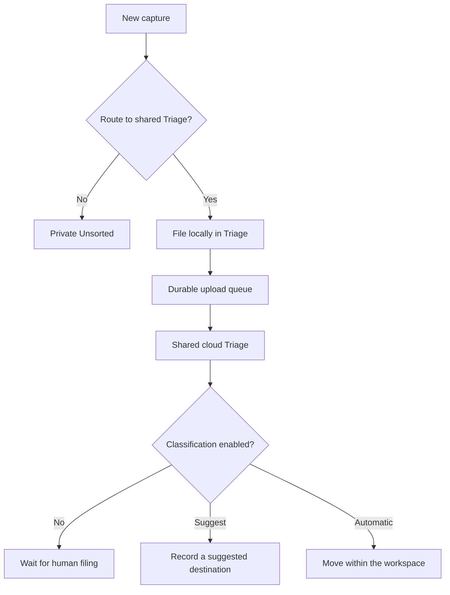

Bowerbirds separates **routing** from **classification**.

Routing chooses where a new capture is born. Classification is optional later work that proposes or performs a move.

## Device routing

When “Route new captures to Triage” is off, captures go to private Unsorted. When it is on, eligible captures are filed into the workspace's shared Triage shelf, added to the durable upload queue, and uploaded serially in the background. A successful upload removes the local queued copy; a failed upload remains queued for retry.

The switch is per person and device, defaults to off, and affects future captures only. Enabling it warns that new eligible captures will enter a shared workspace location.

Clipboard history is excluded from this switch because copying text is not explicit consent to publish it to a workspace.

If the Triage location cannot be prepared—for example, while offline—the local capture falls back to Unsorted instead of being lost.

## Classification policy

An administrator can configure an allowlist of destination Buckets/directories, an optional fallback, and a mode:

- `suggest` records a recommendation without moving the record;
- `both` lets the classifier choose between filing and suggesting for each record;
- `auto` moves the record automatically.

If no destination fits and no fallback exists, the record stays where it is.

## Web Capture triage

Web Capture intake is a separate source. Its classification runs server-side because the submission is already in the cloud. Since a public widget lets a stranger cause a model call, enabling classification for an intake requires an administrator-defined monthly classification ceiling.

The Web Capture classification queue is asynchronous but not durable. If a process restarts or the queue is full, the submitted capture remains safely stored in its intake, but it may remain unclassified until a later action retries it.

<Warning>
  Triage destinations stay inside the same workspace. Web Capture intakes and the Triage shelf itself cannot be selected as destinations.
</Warning>
