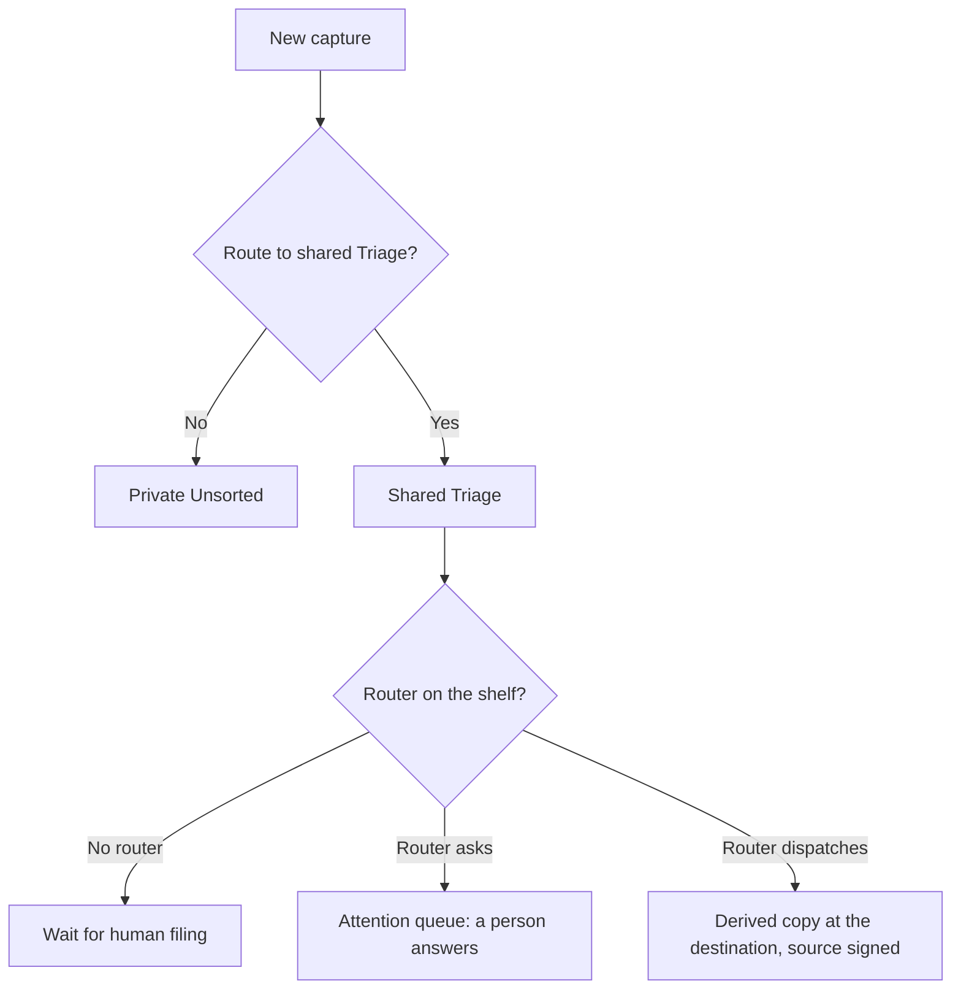

Bowerbirds separates **routing** from **classification**.

Routing chooses where a new capture is born. Classification is optional later work, done by a router on the shared Triage shelf, that derives a copy at a destination or asks a person; it never moves the source.

## Device routing

When “Route new captures to Triage” is off, captures go to private Unsorted. When it is on, eligible captures are filed into the workspace's shared Triage shelf and synced when possible.

The switch is per person and device, defaults to off, and affects future captures only. Enabling it warns that new eligible captures will enter a shared workspace location.

Clipboard history is excluded from this switch because copying text is not explicit consent to publish it to a workspace.

If the shared destination is unavailable—for example, while offline—the capture remains private in Unsorted instead of being lost.

## Classification is a router

Classification on the shared Triage shelf is a **router** attached to the shelf Bucket: a direct router with one route per destination and rule chips (kind, path, tag, keyword, age) the gate checks, or an agentic router whose routes Bowerbirds AI delegates to. Either way the router only adds — it derives a copy into the destination and signs the source with a status, and a cleanup rule on the shelf retires `routed` sources after a grace period — so a record is never silently moved. What used to be the `suggest` mode is the router's attention queue: a route that is not sure asks, with alternatives and a recommendation. See [Routers](/cloud/routers).

The former classification policy (`suggest`, `both`, `auto`, an allowlist and a fallback) is retired; a workspace administrator attaches a router instead.

## Web Capture intakes

A Web Capture intake is a separate source with a router of its own; see [Web Capture](/cloud/web-capture#routing-submitted-reports).

<Warning>
  Destinations stay inside the same workspace or a connected tool. Web Capture intakes and the Triage shelf itself cannot be named as a route's destination.
</Warning>
