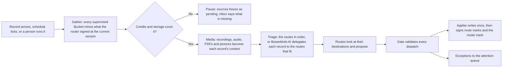

A **router** supervises one or more Buckets and dispatches every record that lands in them. A Bucket has at most one router, and the router — not the Bucket — is what claims a cycle, spends credits and signs. It is one of three kinds: a **direct** router (an ordered list of routes with an optional formatting step), an **agentic** router (Bowerbirds AI triages each record to one or more routes), or an **external** router (your own coding agent runs the loop on its own model). A **route** is one destination scope of the router: where it may write, which connector tools it may use, and the description, goal and rules that decide when a record belongs to it.

A router document that names no `kind` is read as `agentic`.

## Four rules

<CardGroup cols={2}>
  <Card title="One router per Bucket" icon="1">
    A router may supervise several Buckets; a Bucket may be supervised by only one. Attaching a Bucket another router already holds is refused, naming the Bucket and the router that holds it, so no two automations argue over a record.
  </Card>
  <Card title="Routers only add" icon="plus">
    A route never moves, edits or trashes a source record. It derives new records inside the workspace, or creates, appends to or links items at external destinations. Deleting is a cleanup policy's job.
  </Card>
  <Card title="The gate checks every dispatch" icon="shield-check">
    Routes propose; a deterministic gate validates each dispatch against the route's destinations, tool grant and trust; one applier writes. A run that never reaches the gate writes nothing.
  </Card>
  <Card title="Every record is signed" icon="signature">
    Each route signs the source for its part with the destination item's id; the router signs it with a status once every route has reported. A signed record is left alone until it changes.
  </Card>
</CardGroup>

## Kinds

| Kind | How it decides | Example | Credits |
| --- | --- | --- | --- |
| `direct` | An **ordered list** of routes. What it gathers at all is the router's own scope; the record then goes to the first route whose destination is reachable, or to every reachable route when the router fans out. An optional formatting step renders a template, or asks Bowerbirds AI to shape the title and body for the destination. | A Web Capture intake watched under `bugs/*`: what lands there becomes a Linear issue with a generated title and reproduction steps. | Formatting step only |
| `agentic` | Bowerbirds AI reads each record and delegates it to every route whose description fits, with a hint of which part is theirs. Each route searches its destination with the read tools it enabled and answers per record. | One router over the `feedback` and `meetings` Buckets, with routes "Bug → Linear", "Feature idea → Notion", "Decisions → team notes". | Metered per cycle |
| `external` | Your own agent — Claude Code, Codex or any MCP client — holds a token with the `router` role and runs the same loop through the MCP door. A Bucket is still how the agent reaches it; the claim covers every Bucket that router supervises. | `/bowerbirds-route feedback` from your terminal every morning. See [External routers](/cloud/external-routers). | Zero |

## What a route is

```json
{
  "name": "Product feedback",
  "kind": "agentic",
  "goal": "Dispatch what lands in the feedback and meetings Buckets.",
  "scope": {
    "buckets": [
      { "owner": "me", "slug": "feedback" },
      { "owner": "me", "slug": "meetings", "paths": ["reviews", "customer-calls/*"] }
    ],
    "filters": { "kinds": ["capture", "note", "recording"], "keywords": ["bug", "broken"], "ageDays": 90 }
  },
  "trigger": { "arrival": { "threshold": 5, "debounceMinutes": 10 } },
  "budget": { "monthlyCredits": 200 },
  "routes": [
    {
      "id": "bug-linear",
      "name": "Bug → Linear issue",
      "description": "A capture or note that reports something broken, wrong or unexpected.",
      "goal": "One Linear issue per distinct bug; a comment on the existing issue when it is already filed.",
      "rules": { "text": "Search before creating. Never close or edit an existing issue." },
      "skills": ["bowerbirds-records"],
      "connectors": [{
        "connectorId": "linear",
        "tools": {
          "enabled": ["search_issues", "get_issue", "create_issue", "create_comment"],
          "disabled": ["delete_issue", "delete_comment"]
        }
      }],
      "destinations": { "external": [{ "connectorId": "linear", "target": "ENG" }] }
    },
    {
      "name": "Internal notes",
      "description": "A note a teammate wrote about our own process.",
      "rules": { "text": "Keep the team's own words; nothing here leaves the workspace." },
      "destinations": { "paths": ["team/notes/*"], "buckets": ["inbox"] }
    }
  ]
}
```

- **Scope.** `scope.buckets` lists the Buckets this router supervises — several is normal, and a Bucket may be supervised by only one router. Each entry may narrow to `paths` inside *that* Bucket, in the same grammar destinations speak: a bare `reviews` is that folder exactly, `customer-calls/*` is the folder and everything under it, and several paths are ORed. No `paths` at all is the whole Bucket. At most 16 Buckets, at most 8 paths each. A router with no Bucket is legal, gathers nothing, and says so when you run it — `it has no bucket yet: add one to its scope (scope.buckets)`. Attaching a Bucket another router holds is refused on create *and* on edit, naming both:

  ```text
  bucket "bugs" already has a router, "Triage" (rtr_2): a bucket has at most one router — add a route to that one instead
  ```

  A router cannot narrow its scope to record ids or a query. Listing the same Bucket twice is refused too — `bucket "bugs" is listed twice: put every path on the one entry` — and so is a Bucket this workspace does not own: `scope.buckets[0] names bucket "secrets", which is not a bucket you own`. A Bucket shared with you cannot be supervised.

  The list's order is not a priority — every supervised Bucket is gathered in one cycle — but the FIRST entry is where the router's own run records are filed unless the document declares `runRecords`. A first entry that is a [Web Capture intake](/cloud/web-capture) is therefore refused: `this router's run records would be filed into "site-feedback", which is an intake bucket, so it needs runRecords: the bucket its run records go to — nothing the fleet holds may create an item in an intake bucket`. Supervising an intake is fine — the fleet may read one and may never create in one.
- **Filters.** `scope.filters` decides what the router gathers at all, and applies to **every** Bucket it supervises: `kinds` (from `capture`, `recording`, `dictation`, `scratchpad`, `clipboard`, `note`, `file`, `rfi`), `keywords` (matched over the title, the body and the tags) and `ageDays` (nothing older than that many days). Kinds are ORed with each other, keywords are ORed with each other, and the three groups are ANDed. Path is the one filter that is not global: a path only means something inside one Bucket, so it lives on that Bucket's entry.
- **Trigger.** A record arriving in **any** supervised Bucket, under that Bucket's paths (`threshold` records since the last decision, `debounceMinutes` of quiet), a `schedule` with a `cron`, a manual run, or an answered question. The arrival watch names no Bucket of its own: one threshold and one debounce for the router, and a Bucket added to the scope is watched from that moment. One cycle runs at a time per **router**, gathering across every Bucket it supervises; a second start joins the next.
- **Destinations** are the allowlist the gate enforces: `paths` (`bucket/path` or `bucket/path/*`) and `buckets` of the workspace a derivation may land in, and `external` targets inside a linked connector (a Linear team, a GitHub repository, a Notion database). A direct route's external destination also names the `tool` it creates with.
- **Connectors and tool grants.** A route links the workspace connectors it needs and enables or disables each tool by name. Tools in neither list take the connector's default: read-only tools on, destructive tools off, everything off when the server annotates nothing. The enabled read tools are what the route holds while it looks; the enabled write tools bound what the applier may call for that route.
- **Description and goal** are written for Bowerbirds AI: the description is how a record is delegated here, the goal is what the route then tries to do with it.
- **Rules** are prose — `rules.text` — carried into the route's own instructions. A route carries no filters of its own: what the router gathers at all is `scope.filters` and each Bucket's paths, and which route takes a record is its description and goal on an agentic router, or its position in the list on a direct one.
- **Media** is the router's option for the [media processor](/cloud/media#the-routers-media-option): `"media": { "process": "auto", "videoResolution": "low" }` condenses every gathered record's recordings, audio, PDFs and pictures into findings before the cycle delegates, so a route decides from detailed descriptions with chunk references rather than a title and a few stills. Agentic routers only — a direct router never runs the stage.
- **Skills** are workspace skills by id, snapshotted into the run. A plugin can ship a route template with all of this plus the connector it expects; see [Plugins](/integrations/plugins).
- **Trust** is earned per route. Links, appends and derivations run unattended from the first cycle. Creating an external item asks a person until the route's first accepted create, then runs unattended.
- **Direct routers only:** the routes are tried in the **order they are arranged**, and the first route whose destination is reachable takes the record. `"fanOut": true` on the **router** (not on a route) lets every reachable route take it instead. A route with nowhere to go — an internal Bucket that is gone, or a connector the route no longer links — is skipped with its reason on the run report and the next route is tried; a record no route could take answers `none` and the router signs it `kept`. A connector that is linked but not answering right now **parks** the record rather than letting the next route have it, because a record a rule aimed at Linear should wait for Linear. `format: { "template": "…", "prompt": "…" }` shapes what reaches the destination — a template over `.Title`, `.Content`, `.Kind`, `.Path`, `.Tags`, `.Comments` is rendered with no model call; a prompt asks Bowerbirds AI and is metered like any call.
- **Agentic and external routers:** the order of the routes carries no meaning at all. The brain delegates by each route's description and goal, reads the roster in no particular order, and a record may reach several routes — so the editors do not offer to arrange the list, and rearranging it in a stored document changes nothing.

## The dispatch vocabulary

For every record it was handed, a route answers exactly one of these, with a `reason` and a `confidence` (`high`, `medium`, `low`):

| Kind | Meaning | Where |
| --- | --- | --- |
| `derive` | A new record in the workspace: a split (one of several pieces) or an augmented copy (generated title, summary, extracted fields). Carries `derivedFrom`, the route and a depth; the source's payload bytes are copied on purpose so the derived record can be processed on its own. | A path or Bucket in the route's destinations |
| `merge` | A derivation that lands **beside what it relates to**: the derived record is placed into an existing Package the route found, or a new Package is made of the related records and the derived one. A merge is a derivation for the caps — the same depth, origin and daily breakers count it beside `derive`. | A path or Bucket in the route's destinations; the Package's own place |
| `create` | A new item at an external destination | A target in a linked connector, through an enabled tool |
| `append` | A comment or attachment on an existing external item | Same |
| `link` | The record refers to an existing item; nothing is written | Same |
| `none` | Nothing to do — and that is a decision, so it is marked too | — |
| `ask` | A question for a person, with argued alternatives and a recommended one | The attention queue |

The lattice is `none < link < append < derive < create`; `merge` is judged as a derivation. Nothing in it edits, moves or trashes the source — a router only adds.

## A cycle



1. **Gather.** Every supervised Bucket's records — under that Bucket's paths, narrowed by the router's global filters — minus those the router already signed at their current fingerprint. One cycle covers all of them, and each record keeps the Bucket it belongs to. Records with partial route marks from an earlier cycle go only to the routes still missing.
2. **Pre-flight.** Credits and storage are checked against the record count — and the media the records carry — before anything is spent.
3. **Media.** On an agentic router, each gathered record with media and no current findings document is condensed by the [media processor](/cloud/media) into a summary and findings, each citing the chunk and moment it came from. A record already read at its current version costs nothing again; one whose media is still uploading is deferred, unsigned, to the next cycle.
4. **Delegate.** A direct router tries its routes in order. An agentic router reads each finding's description against each route's description and goal and answers a delegation table: which findings go to which route, and why. A finding may go to several routes; one that fits no route is reported unrouted, never invented into one. A record with no media is delegated on its own words — one finding per numbered comment, or per paragraph.
5. **Route.** Each delegated route receives only its findings, the chunk references and the source record's id. It searches its destination for what already exists — `search_records` and `get_record` inside the workspace, the connector's read tools outside it, `get_media_chunk` when a description is not detail enough — and then answers: merge beside the related record, update the existing item, create a new one linked to its relatives, or nothing.
6. **Gate.** Every dispatch is validated; see the table below. The plan that survives is the plan that runs.
7. **Apply and sign.** One applier writes: derived records with provenance and copied bytes, external items through the linked connector, each checked against the source's existing links so a retry never creates twice. It signs a route mark per route with the destination item's id, then the router mark with its status once every delegated route reported.
8. **Report.** Exceptions become attention rows; the ledger gets one line per model turn with the job id; the run record holds the dispatches, the gate's decisions, the delegation table, the findings no route was given, the media stage's counts and chunk plan, and the cost.

## What the gate does

| The routes proposed | Outcome |
| --- | --- |
| A dispatch inside the route's allowlist, from a trusted route | Dispatched |
| A destination outside the route's allowlist | Dropped, recorded as clamped, record kept |
| A `merge` into a Package outside the route's allowlist, or into the record being routed | Dropped, recorded as clamped |
| A dispatch needing a tool the route disabled or never enabled | Dropped, recorded as clamped |
| Two routes derive the same thing (same path, same content) | One derivation, both routes marked |
| `create` where the record already links to an item there | Turned into `append` or `link`, recorded as clamped |
| `create` at an external destination from a route not yet trusted | Asked, with the dispatch as the recommended alternative |
| A derivation past depth 3, or back into a Bucket in the source's origin chain | Dropped and asked (the circuit breaker) |
| More than 5 derivations from one source in a day | Kept and asked |
| `none` from every route | Router status `kept` |
| No route fits | Kept, marked; asked only if the router asked |

A direct router reaches the ask row only on a failed integration or a route that names a connector nobody has connected.

## Signatures and statuses

Two levels of mark live beside every record the router handled:

- A **route mark** per route: the dispatch kind, the destination item's id (a derived record's id, the Package a merge landed in, a Linear issue, a GitHub issue number), the finding ids the decision rested on, and the cycle. Route marks are also the dedupe memory: a later capture about the same bug finds its issue by the link.
- A **router mark** with a status, written only when every delegated route has reported:

| Status | Meaning |
| --- | --- |
| `routed` | Dispatched externally (create, append or link); the source stays the live record |
| `processed` | Something was derived or merged; the derived records are now the live ones |
| `kept` | Every route said `none` |
| `pending` | A route still owes an answer, or the workspace's routers are paused |

Marks carry the fingerprint the record had when it was signed. An edited source is fresh again to the router; a record moved into another Bucket is fresh to the router supervising *that* Bucket. A derived record landing in **any** Bucket this router supervises is signed `routed` at birth, so a router never gathers its own output.

Listings, the record view and the MCP door answer the same reading on every record: `routerStatus {status, cycleId, at, missing}`, `links [{route, kind, destination}]` and `derivedFrom`. The apps show them as chips — "routed → Linear ENG-123", "kept", "pending on bugs" — and a derived record shows its origin.

## Cleanup by status

A supervised Bucket fills with sources that have already become something else. The Bucket's cleanup policy gains a rule kind beside `retentionDays`, set by an administrator on the Bucket:

```json
{ "cleanupRules": [{ "kind": "routerStatus", "status": "routed", "olderThanDays": 7 }] }
```

- The daily sweep **trashes** matching sources; nothing is deleted for good until the workspace's own retention purges the Trash.
- The clock is the **mark's**, not the record's: a grace period after the router's decision.
- A source edited since it was signed is skipped: the router has not seen that version.
- `pending` is refused as a rule status and never touched by any rule, so a workspace that ran out of credits cannot lose the records it froze.
- `olderThanDays` is at least 1. A derived record signed `routed` at birth ages out on the same clock as any other record.

A move with an audit trail and a grace period is exactly a derivation, a `routed` signature, and this rule.

## Credits, pause and resume

- The **budget pre-flight** compares the workspace balance and the router's `budget.monthlyCredits` against the gathered records before spending anything. Manual runs honour the same caps.
- A **spend guard** stops a cycle when the next model call is unaffordable; the partial plan is filed and marked, never an overdraft.
- Every ledger line carries the **job id**; a run's cost is summed exactly on its run record. Reclaimed runs are not re-charged.
- The **media stage** is priced in the pre-flight from the duration the probe measured. When plan plus media would exceed the balance or the router's month, media is switched off for that cycle with a note, never a pause; see [Media findings](/cloud/media#credits).
- Out of credits or out of storage **pauses every router of the workspace** (`routersPaused {reason: credits | storage, since}` on the workspace). The sources the paused cycle gathered stay `pending` and render as frozen in both apps; an inbox notice says what to buy or free. A top-up or freed space enqueues the resume by itself, and the resumed cycle re-delegates only the routes still missing, so no dispatch is duplicated.

`bowerbirds cloud routers run <id>` exits with the parked reason when a cycle pauses; `bowerbirds cloud routers runs <id> --cost` lists what each cycle cost.

## The attention queue

A person is asked in exactly these cases, and nowhere else:

- an external item created by a route that has not yet earned trust (`untrusted`);
- a dispatch the gate clamped and the router wants a decision on (`clamped`);
- a tripped hop budget or ping-pong detector (`breaker`);
- a budget or storage shortfall (`budget`);
- a connector that refused, expired or was revoked (`integration`);
- a route that explicitly asked, with alternatives and a recommendation (`ask`).

Every row lands in the Routers inbox on Mac and iOS and as an RFI in the cloud, with argued alternatives and the recommended one marked. Answering it runs a child cycle over the flagged records only, and answering an untrusted create earns the route unattended creates from then on.

```sh
bowerbirds cloud routers attention [<router-id>] [--state open|handled]
bowerbirds cloud routers answer <attention-id> --alternative 1
bowerbirds cloud routers answer <attention-id> --text "File it under ENG, not OPS"
```

## From the CLI

```sh
bowerbirds cloud routers list
bowerbirds cloud routers show <router-id>
bowerbirds cloud routers create --file router.json
bowerbirds cloud routers update <router-id> --file router.json
bowerbirds cloud routers delete <router-id>
bowerbirds cloud routers run <router-id> [--items id,id] [--follow]
bowerbirds cloud routers runs <router-id> [--cost]
```

`cloud routers create` refuses a Bucket that already has a router, naming the Bucket and the router that holds it — and it names every such Bucket at once, not the first. `run --items` routes the records it NAMES: a person who named a record has chosen it, so the router's filters and its per-Bucket paths are not applied to those. Deleting a router keeps its marks on records and the runs it filed. See [Cloud CLI workflows](/cli/cloud-workflows#routers) for connectors, plugins and skills, and [External routers](/cloud/external-routers) for a router your own agent drives.
