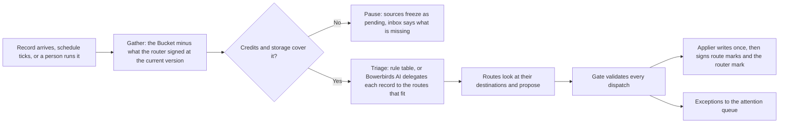

A **router** sits on one Bucket and dispatches every record that lands there. It is one of three kinds: a **direct** router (a rule table with an optional formatting step), an **agentic** router (Bowerbirds AI triages each record to one or more routes), or an **external** router (your own coding agent runs the loop on its own model). A **route** is one destination scope of the router: where it may write, which connector tools it may use, and the description, goal and rules that decide when a record belongs to it.

Routers replaced Flows on 11 September 2026. Nothing was migrated: a flow's goal, scope and outcomes became a router's kind, Bucket and routes. The `cloud flows` verbs remain as a deprecated alias of `cloud routers`, and a router document with no `kind` is read as `agentic`.

## Four rules

<CardGroup cols={2}>
  <Card title="One router per Bucket" icon="1">
    Attaching a second router to a Bucket is refused. Anything the Bucket needs is a route of its one router, so no two automations argue over a record.
  </Card>
  <Card title="Routers only add" icon="plus">
    A route never moves, edits or trashes a source record. It derives new records inside the workspace, or creates, appends to or links items at external destinations. Deleting is a cleanup policy's job.
  </Card>
  <Card title="The gate checks every dispatch" icon="shield-check">
    Routes propose; a deterministic gate validates each dispatch against the route's destinations, tool grant and trust; one applier writes. A run that never reaches the gate writes nothing.
  </Card>
  <Card title="Every record is signed" icon="signature">
    Each route signs the source for its part with the destination item's id; the router signs it with a status once every route has reported. A signed record is left alone until it changes.
  </Card>
</CardGroup>

## Kinds

| Kind | How it decides | Example | Credits |
| --- | --- | --- | --- |
| `direct` | A rule table over the Bucket: kind, path, tag, keyword or age → destination, first match wins unless a route fans out. An optional formatting step renders a template, or asks Bowerbirds AI to shape the title and body for the destination. | Records landing under `bugs/` in a Web Capture intake become Linear issues with a generated title and reproduction steps. | Formatting step only |
| `agentic` | Bowerbirds AI reads each record and delegates it to every route whose description fits, with a hint of which part is theirs. Each route searches its destination with the read tools it enabled and answers per record. | A "product feedback" Bucket with routes "Bug → Linear", "Feature idea → Notion", "Internal → team notes". | Metered per cycle |
| `external` | Your own agent — Claude Code, Codex or any MCP client — holds a token with the `router` role and runs the same loop through the MCP door. | `/bowerbirds-route feedback` from your terminal every morning. See [External routers](/cloud/external-routers). | Zero |

## What a route is

```json
{
  "name": "Product feedback",
  "kind": "agentic",
  "goal": "Dispatch what lands in the feedback Bucket.",
  "records": { "bucket": { "owner": "me", "slug": "feedback" } },
  "trigger": { "arrival": { "bucket": { "slug": "feedback" }, "threshold": 5, "debounceMinutes": 10 } },
  "budget": { "monthlyCredits": 200 },
  "routes": [
    {
      "id": "bug-linear",
      "name": "Bug → Linear issue",
      "description": "A capture or note that reports something broken, wrong or unexpected.",
      "goal": "One Linear issue per distinct bug; a comment on the existing issue when it is already filed.",
      "rules": {
        "text": "Search before creating. Never close or edit an existing issue.",
        "filters": [{ "field": "kind", "op": "in", "value": ["capture", "note"] }]
      },
      "skills": ["bowerbirds-records"],
      "connectors": [{
        "connectorId": "linear",
        "tools": {
          "enabled": ["search_issues", "get_issue", "create_issue", "create_comment"],
          "disabled": ["delete_issue", "delete_comment"]
        }
      }],
      "destinations": { "external": [{ "connectorId": "linear", "target": "ENG" }] }
    },
    {
      "name": "Internal notes",
      "description": "A note a teammate wrote about our own process.",
      "rules": { "filters": [{ "field": "tag", "op": "has", "value": "internal" }] },
      "destinations": { "paths": ["team/notes/*"], "buckets": ["inbox"] }
    }
  ]
}
```

- **Scope.** `records.bucket` is the whole Bucket. A router cannot narrow its scope to ids or a query, and cannot attach a second Bucket: what a route should skip goes in that route's rules.
- **Trigger.** A record arriving (`threshold` records since the last decision, `debounceMinutes` of quiet), a `schedule` with a `cron`, a manual run, or an answered question. One cycle runs at a time per Bucket; a second start joins the next.
- **Destinations** are the allowlist the gate enforces: `paths` (`bucket/path` or `bucket/path/*`) and `buckets` of the workspace a derivation may land in, and `external` targets inside a linked connector (a Linear team, a GitHub repository, a Notion database). A direct route's external destination also names the `tool` it creates with.
- **Connectors and tool grants.** A route links the workspace connectors it needs and enables or disables each tool by name. Tools in neither list take the connector's default: read-only tools on, destructive tools off, everything off when the server annotates nothing. The enabled read tools are what the route holds while it looks; the enabled write tools bound what the applier may call for that route.
- **Description and goal** are written for Bowerbirds AI: the description is how a record is delegated here, the goal is what the route then tries to do with it.
- **Rules** are prose plus filter chips the gate checks deterministically: `kind` (`is`, `isNot`, `in`, `notIn`), `path` (`startsWith`), `tag` and `keyword` (`has`, `hasNot`), `ageDays` (`atMost`). A direct route with no chips is the catch-all row.
- **Skills** are workspace skills by id, snapshotted into the run. A plugin can ship a route template with all of this plus the connector it expects; see [Plugins](/integrations/plugins).
- **Trust** is earned per route. Links, appends and derivations run unattended from the first cycle. Creating an external item asks a person until the route's first accepted create, then runs unattended.
- **Direct routes only:** `fanOut: true` lets a matched record continue to the routes after it; `format: { "template": "…", "prompt": "…" }` shapes what reaches the destination — a template over `.Title`, `.Content`, `.Kind`, `.Path`, `.Tags`, `.Comments` is rendered with no model call; a prompt asks Bowerbirds AI and is metered like any call.

## The dispatch vocabulary

For every record it was handed, a route answers exactly one of these, with a `reason` and a `confidence` (`high`, `medium`, `low`):

| Kind | Meaning | Where |
| --- | --- | --- |
| `derive` | A new record in the workspace: a split (one of several pieces) or an augmented copy (generated title, summary, extracted fields). Carries `derivedFrom`, the route and a depth; the source's payload bytes are copied on purpose so the derived record can be processed on its own. | A path or Bucket in the route's destinations |
| `create` | A new item at an external destination | A target in a linked connector, through an enabled tool |
| `append` | A comment or attachment on an existing external item | Same |
| `link` | The record refers to an existing item; nothing is written | Same |
| `none` | Nothing to do — and that is a decision, so it is marked too | — |
| `ask` | A question for a person, with argued alternatives and a recommended one | The attention queue |

The lattice is `none < link < append < derive < create`. Nothing in it edits, moves or trashes the source.

## A cycle



1. **Gather.** The Bucket's records minus those the router already signed at their current fingerprint. Records with partial route marks from an earlier cycle go only to the routes still missing.
2. **Pre-flight.** Credits and storage are checked against the record count before anything is spent.
3. **Triage.** A direct router evaluates its rule table. An agentic router delegates each record to every route whose description fits and hands each route its whole batch, so three captures about one bug are seen together.
4. **Route.** Each route searches its destinations with its enabled read tools, groups what belongs together, and answers per record.
5. **Gate.** Every dispatch is validated; see the table below. The plan that survives is the plan that runs.
6. **Apply and sign.** One applier writes: derived records with provenance and copied bytes, external items through the linked connector, each checked against the source's existing links so a retry never creates twice. It signs a route mark per route with the destination item's id, then the router mark with its status once every delegated route reported.
7. **Report.** Exceptions become attention rows; the ledger gets one line per model turn with the job id; the run record holds the dispatches, the gate's decisions and the cost.

## What the gate does

| The routes proposed | Outcome |
| --- | --- |
| A dispatch inside the route's allowlist, from a trusted route | Dispatched |
| A destination outside the route's allowlist | Dropped, recorded as clamped, record kept |
| A dispatch needing a tool the route disabled or never enabled | Dropped, recorded as clamped |
| Two routes derive the same thing (same path, same content) | One derivation, both routes marked |
| `create` where the record already links to an item there | Turned into `append` or `link`, recorded as clamped |
| `create` at an external destination from a route not yet trusted | Asked, with the dispatch as the recommended alternative |
| A derivation past depth 3, or back into a Bucket in the source's origin chain | Dropped and asked (the circuit breaker) |
| More than 5 derivations from one source in a day | Kept and asked |
| `none` from every route | Router status `kept` |
| No route fits | Kept, marked; asked only if the router asked |

A direct router reaches the ask row only on a failed integration or a rule that names a connector nobody has connected.

## Signatures and statuses

Two levels of mark live beside every record the router handled:

- A **route mark** per route: the dispatch kind, the destination item's id (a derived record's id, a Linear issue, a GitHub issue number), and the cycle. Route marks are also the dedupe memory: a later capture about the same bug finds its issue by the link.
- A **router mark** with a status, written only when every delegated route has reported:

| Status | Meaning |
| --- | --- |
| `routed` | Dispatched externally (create, append or link); the source stays the live record |
| `processed` | Something was derived; the derived records are now the live ones |
| `kept` | Every route said `none` |
| `pending` | A route still owes an answer, or the workspace's routers are paused |

Marks carry the fingerprint the record had when it was signed. An edited source is fresh again to the router; a record moved into another Bucket is fresh to that Bucket's router. A derived record placed in the same Bucket is signed `routed` at birth so it is never re-derived.

Listings, the record view and the MCP door answer the same reading on every record: `routerStatus {status, cycleId, at, missing}`, `links [{route, kind, destination}]` and `derivedFrom`. The apps show them as chips — "routed → Linear ENG-123", "kept", "pending on bugs" — and a derived record shows its origin.

## Cleanup by status

A Bucket with a router fills with sources that have already become something else. The Bucket's cleanup policy gains a rule kind beside `retentionDays`, set by an administrator on the Bucket:

```json
{ "cleanupRules": [{ "kind": "routerStatus", "status": "routed", "olderThanDays": 7 }] }
```

- The daily sweep **trashes** matching sources; nothing is deleted for good until the workspace's own retention purges the Trash.
- The clock is the **mark's**, not the record's: a grace period after the router's decision.
- A source edited since it was signed is skipped: the router has not seen that version.
- `pending` is refused as a rule status and never touched by any rule, so a workspace that ran out of credits cannot lose the records it froze.
- `olderThanDays` is at least 1. A derived record signed `routed` at birth ages out on the same clock as any other record.

A move with an audit trail and a grace period is exactly a derivation, a `routed` signature, and this rule.

## Credits, pause and resume

- The **budget pre-flight** compares the workspace balance and the router's `budget.monthlyCredits` against the gathered records before spending anything. Manual runs honour the same caps.
- A **spend guard** stops a cycle when the next model call is unaffordable; the partial plan is filed and marked, never an overdraft.
- Every ledger line carries the **job id**; a run's cost is summed exactly on its run record. Reclaimed runs are not re-charged.
- Out of credits or out of storage **pauses every router of the workspace** (`routersPaused {reason: credits | storage, since}` on the workspace). The sources the paused cycle gathered stay `pending` and render as frozen in both apps; an inbox notice says what to buy or free. A top-up or freed space enqueues the resume by itself, and the resumed cycle re-delegates only the routes still missing, so no dispatch is duplicated.

`bowerbirds cloud routers run <id>` exits with the parked reason when a cycle pauses; `bowerbirds cloud routers runs <id> --cost` lists what each cycle cost.

## The attention queue

A person is asked in exactly these cases, and nowhere else:

- an external item created by a route that has not yet earned trust (`untrusted`);
- a dispatch the gate clamped and the router wants a decision on (`clamped`);
- a tripped hop budget or ping-pong detector (`breaker`);
- a budget or storage shortfall (`budget`);
- a connector that refused, expired or was revoked (`integration`);
- a route that explicitly asked, with alternatives and a recommendation (`ask`).

Every row lands in the Routers inbox on Mac and iOS and as an RFI in the cloud, with argued alternatives and the recommended one marked. Answering it runs a child cycle over the flagged records only, and answering an untrusted create earns the route unattended creates from then on.

```sh
bowerbirds cloud routers attention [<router-id>] [--state open|handled]
bowerbirds cloud routers answer <attention-id> --alternative 1
bowerbirds cloud routers answer <attention-id> --text "File it under ENG, not OPS"
```

## From the CLI

```sh
bowerbirds cloud routers list
bowerbirds cloud routers show <router-id>
bowerbirds cloud routers create --file router.json
bowerbirds cloud routers update <router-id> --file router.json
bowerbirds cloud routers delete <router-id>
bowerbirds cloud routers run <router-id> [--items id,id] [--follow]
bowerbirds cloud routers runs <router-id> [--cost]
```

`cloud routers create` refuses a second router on a Bucket with a sentence naming the first. Deleting a router keeps its marks on records and the runs it filed. See [Cloud CLI workflows](/cli/cloud-workflows#routers) for connectors, plugins and skills, and [External routers](/cloud/external-routers) for a router your own agent drives.
