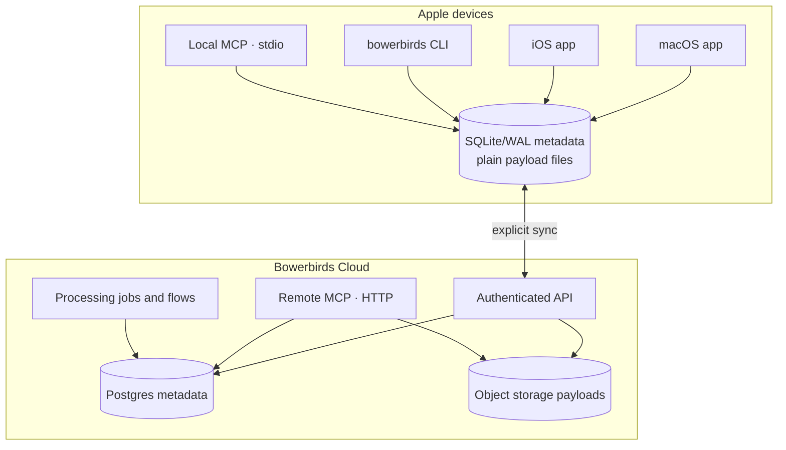

Bowerbirds has multiple doors over one context model. The door you choose changes where the data lives and which capabilities are available; it does not change what a Bucket or record means.

## Local plane

The app, CLI, and local MCP server use `BowerbirdsKit` and the same local store. Metadata is held in SQLite with WAL enabled; payload bytes live as ordinary files beside it.

The processes remain deliberately separate:

- The apps own UI, screen and audio capture, system permissions, Keychain access, global shortcuts, and interactive AI features.
- Local CLI commands and the local MCP server read and write the store directly. Starting either does not launch the app. MCP tool calls require an existing Bowerbirds cloud sign-in even though their data operations are local.
- Local MCP is not a network service. It speaks MCP over standard input and output.

## Cloud plane

Cloud is optional. It adds workspace identity, cross-device structure and record sync, sharing, browser capture, server-side processing, and the remote MCP door.

The remote MCP server is intentionally narrower than local MCP. A token grants one role on one Bucket; it cannot browse the rest of a workspace or private device staging.

## Capability matrix

| Capability | App | CLI | Local MCP | Remote MCP |
| --- | :---: | :---: | :---: | :---: |
| Read filed local records | ✓ | ✓ | ✓ | — |
| Read one shared cloud Bucket | ✓ | ✓ | — | ✓ |
| Capture screen/audio | ✓ | — | Consent request only | — |
| Import a local path | ✓ | ✓ | ✓ | — |
| Edit a revisioned Scratchpad | ✓ | ✓ | ✓ | — |
| File a cloud finding | ✓ | ✓ | — | With contribute/admin token |
| Access private Unsorted | ✓ | Known-ID capture edit only | — | — |
| Run cloud flows | ✓ | ✓ | — | — |

<Note>
  Cloud sync is explicit. Local-first does not mean every local Bucket is silently uploaded.
</Note>
