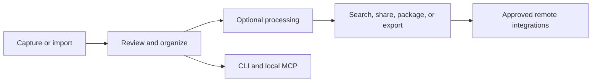

Bowerbirds turns captured material into organized context that people and approved tools can use.

## Local work

The macOS and iOS apps are the main surfaces for capture, review, annotation, and organization. The macOS CLI and local MCP connection let scripts and AI clients work with filed local Buckets.

Content in **Unsorted** remains private to the device and is not available through MCP. File a record into a Bucket before using it programmatically.

## Cloud work

Cloud features are optional and operate on the Buckets you choose to sync or share. They enable collaboration, cross-device access, Web Capture, and approved remote integrations.

## Choose an integration

| Need | Recommended surface |
| --- | --- |
| Capture or review content | Bowerbirds app |
| Automate on the same Mac | CLI |
| Give a local AI client access | Local MCP |
| Connect an approved hosted agent | Remote MCP |

<Note>
  Screen and microphone capture always remains a visible, user-controlled app action.
</Note>
