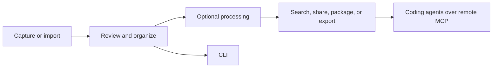

Bowerbirds turns captured material into organized context that people and approved tools can use.

## Local work

The macOS and iOS apps are the main surfaces for capture, review, annotation, and organizing. The macOS CLI lets scripts work with filed local Buckets and, signed in, with the cloud.

Content in **Unsorted** remains private to the device and is not available to agents. File a record into a Bucket before using it programmatically.

## Cloud work

Cloud features are optional and operate on the Buckets you choose to sync or share. They enable collaboration, cross-device access, Web Capture, routers that dispatch what lands in a Bucket, and approved remote integrations.

## Choose an integration

| Need | Recommended surface |
| --- | --- |
| Capture or review content | Bowerbirds app |
| Automate on the same Mac | CLI |
| Connect a coding agent | Remote MCP, approved in your browser |
| Dispatch what lands in a Bucket | A [router](/cloud/routers): rules, Bowerbirds AI, or [your own agent](/cloud/external-routers) |

<Note>
  Screen and microphone capture always remains a visible, user-controlled app action.
</Note>
