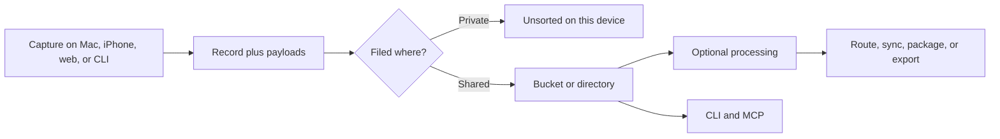

Bowerbirds is a local-first context workspace for people and AI agents. It turns screenshots, recordings, notes, clipboard items, and files into durable records that can be searched, processed, packaged, and routed. Dictation can also deliver text directly into the active app without creating a record.

<CardGroup cols={2}>
  <Card title="Start with the CLI" icon="terminal" href="/cli/overview">
    Read and write the same local store as the macOS app, with JSON receipts for automation.
  </Card>
  <Card title="Connect an agent" icon="plug" href="/mcp/overview">
    Use the local stdio server or a bucket-scoped remote MCP connection.
  </Card>
  <Card title="Understand the data flow" icon="route" href="/workflows/capture-to-context">
    Follow a record from capture through processing, filing, sync, and downstream use.
  </Card>
  <Card title="Build a Package" icon="box-archive" href="/workflows/packages">
    Compose records and visual scenes into a portable Package v2 document.
  </Card>
</CardGroup>

## The one-minute model

- A **record** holds searchable metadata and content.
- **Payloads** are named files attached to a record: images, audio, video, JSON, Markdown, or any imported file.
- A **Bucket** is the top-level unit of organization and sharing. Directories organize records inside it.
- **Unsorted** is private device-local staging. Normal CLI discovery and all MCP doors cannot enumerate it.
- A **Package** is a portable ordered collection of records and visual scenes. Source records remain unchanged.

<Info>
  Bowerbirds follows a file-first rule: the raw artifact is made durable before optional AI work. A failed polish or analysis step does not erase the capture.
</Info>

## Choose your door

| Surface | Best for | Scope |
| --- | --- | --- |
| macOS and iOS apps | Capture, review, annotation, and human decisions | Local plus signed-in workspace |
| CLI | Shell scripts, imports, exports, and machine-readable automation | Local store and authenticated cloud |
| Local MCP | Rich agent workflows over the local store | Filed local Buckets only |
| Remote MCP | Giving an external agent access to one shared Bucket | Exactly one cloud Bucket and one role |
| Web Capture | Collecting annotated reports from a website visitor | Write-only publishable key |

<Note>
  Older builds and paths may still use the command name `trove`. It is a compatibility alias; new integrations should use `bowerbirds`.
</Note>
