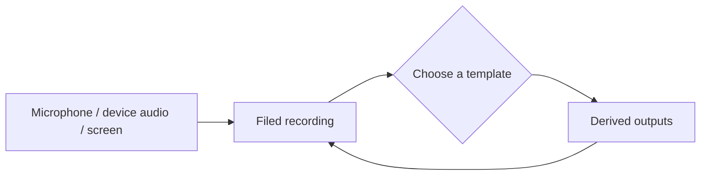

Recording and processing are separate actions. Bowerbirds first files the selected raw sources, then lets a person choose what to derive from them. The original payloads are never replaced.

## Record first



Recording can use microphone, device audio, screen, or a supported combination. A recording can therefore be audio-only, screen-only, or a combined walkthrough.

## Template outputs

One template can request one or more outputs:

| Output | Result |
| --- | --- |
| Notes | A separately filed note structured by the template |
| Transcript | A flat note with each speaker turn and timestamp, without rewriting |
| Annotated frames | A Package of selected, marked-up frames; notes are embedded when requested too |
| Frames | A Package of selected frames as-is, composed on device without AI |
| Altered recording | A new video payload with annotations and captions rendered in |

Bundled templates are **Transcript**, **Meeting notes**, **1:1**, **Stand-up**, **Walkthrough guide**, and **Bug report**. Workspace templates can be edited, removed, restored, or created to combine outputs differently.

Start processing from the app or CLI and follow its progress there.

```sh
bowerbirds cloud recording process <bucket-slug> <item-id> \
  --template <template-id> \
  --frames 5.0,18.4,42.0 \
  --follow
```

## Quick Blink

Quick Blink is a device-only post-processing path for screen recordings. Choose a span from the recording detail, review frames around visual changes, and save the selected frames as a Package. Quick Blink uses no AI and sends nothing off the device.
